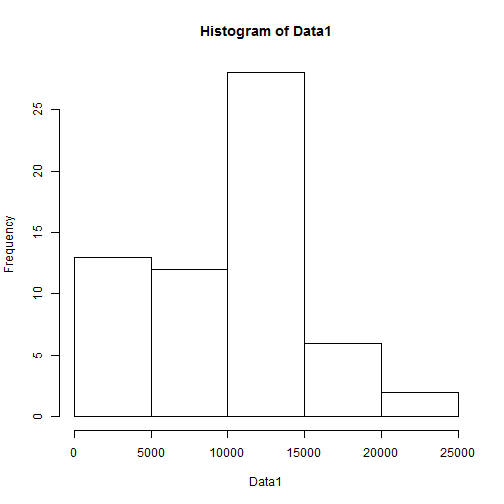
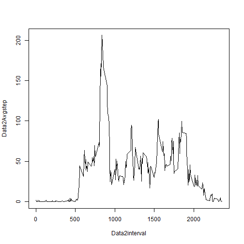
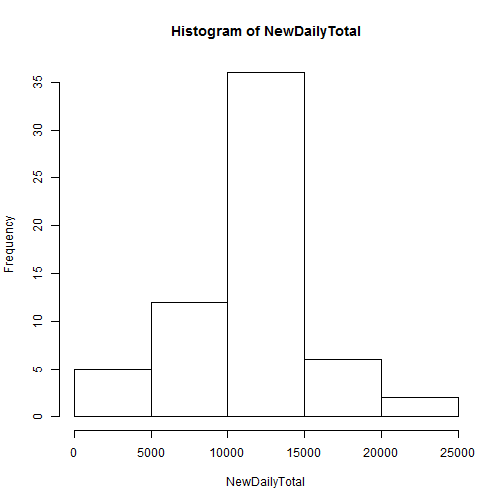
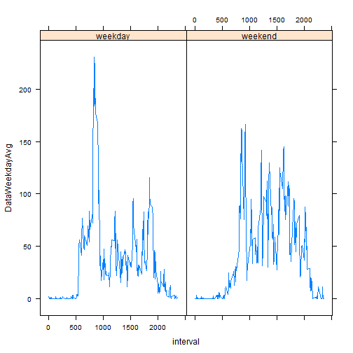

Reproducible Research Project 1
========================================================
Tianyuan "Robert" Zhang

## Loading and preprocessing the data
Read csv file, and process the data. 

```r
Data <- read.csv("./activity.csv")
```


## What is mean total number of steps taken per day?
The historgram of the daily steps taken is

```r
Data1 <- tapply(Data$steps, Data$date, sum, na.rm = TRUE)
hist(Data1)
```

 

The mean and mean and median of the daily steps.

```r
Mean <- mean(Data1, na.rm = TRUE)
Median <- median(Data1, na.rm = TRUE)
Mean
```

```
## [1] 9354
```

```r
Median
```

```
## [1] 10395
```


## What is the average daily activity pattern?
The average time series data set for average steps taken per interval across all days is created and store in Data2. The series is ploted in the following graph.

```r
Data2Avgstep <- tapply(Data$steps, Data$interval, mean, na.rm = TRUE)
Data2interval <- unique(Data$interval)
plot(Data2interval, Data2Avgstep, type = "l")
```

 

The interval that has the greatest average number of steps is

```r
Data2interval[which.max(Data2Avgstep)]
```

```
## [1] 835
```


Imputing missing values
The total number of rows with missing value is 

```r
nrow(Data) - sum(complete.cases(Data))
```

```
## [1] 2304
```

Imputting missing value strategy: replace the missing value with the interval step average across days. Show the histogram of new daily total steps, its mean, and median.

```r
Replacement <- rep(Data2Avgstep, nrow(Data)/nrow(Data2Avgstep))
DataN <- read.csv("./activity.csv")
DataN$steps[is.na(DataN$steps)] <- Replacement[is.na(DataN$steps)]
NewDailyTotal <- tapply(DataN$steps, DataN$date, sum)
hist(NewDailyTotal)
```

 

```r
NewMean <- mean(NewDailyTotal)
NewMedian <- median(NewDailyTotal)
NewMean
```

```
## [1] 10766
```

```r
NewMedian
```

```
## [1] 10766
```

The values and distribution are different from the estimate from the first part of the assignment. Inputing missing data normalizes the data. The data is more or less symmetric. 

## Are there differences in activity patterns between weekdays and weekends?

```r
DataN$Weekends <- weekdays(as.Date(DataN$date)) %in% c("Sunday", "Saturday")
DataWeekday <- DataN[DataN$Weekends == FALSE, ]
DataWeekend <- DataN[DataN$Weekends == TRUE, ]
interval <- unique(DataN$interval)
DataWeekdayAvg <- tapply(DataWeekday$steps, DataWeekday$interval, mean)
Weekday <- rep("weekday", length(DataWeekdayAvg))
DataDay <- data.frame(interval, DataWeekdayAvg, Weekday)

DataWeekdayAvg <- tapply(DataWeekend$steps, DataWeekend$interval, mean)
Weekday <- rep("weekend", length(DataWeekdayAvg))
DataEnd <- data.frame(interval, DataWeekdayAvg, Weekday)

library(lattice)
Plotdata <- rbind(DataDay, DataEnd)
xyplot(DataWeekdayAvg ~ interval | Weekday, Plotdata, type = "l")
```

 


